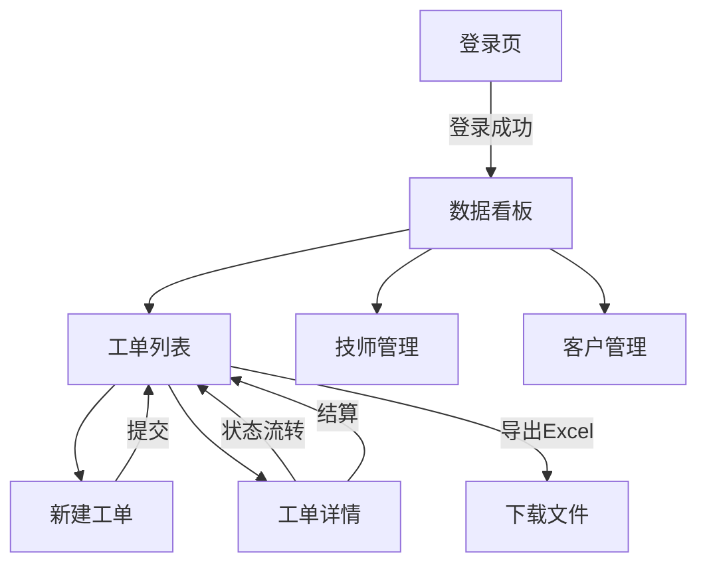
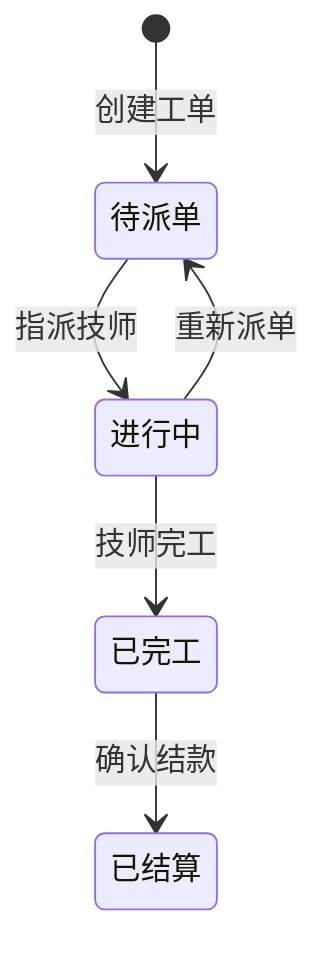

# PRD：维修派单管家

## 1. 产品定位

- **产品名称**：维修派单管家
- **一句话痛点**：解决中小维修公司"微信群里接单 → 电话派工 → 完工对不上账"的混乱现状，用一个页面完成报修录入、智能派单、进度追踪、完工结算的全流程闭环
- **目标用户画像**：
  - **王姐**：某物业维修公司派单员，每天接 20-30 个业主报修电话，手动记在本子上再微信通知师傅，经常漏单、重复派单
  - **张师傅**：维修技师，同时接多个公司的活，靠微信聊天记录回忆自己干了什么、该结多少钱
  - **刘总**：公司老板，月底拉 Excel 对账靠人工统计，想知道这个月哪个小区报修最多、哪个师傅效率最高

## 2. MVP 功能清单

| 序号 | 功能点 | 优先级 | 说明 |
|------|--------|--------|------|
| 1 | 工单管理（创建/派单/状态流转） | P0 | 核心业务流程：待派单→进行中→已完工→已结算 |
| 2 | 登录鉴权 + 角色权限 | P0 | 管理员全量操作，技师只看自己工单 |
| 3 | 数据看板 | P0 | ECharts 折线图（近7天工单趋势）+ 饼图（工单状态分布） |
| 4 | 技师管理 | P0 | 技师信息维护，派单时下拉选择 |
| 5 | 完工结算 | P0 | 录入维修费用，标记已结款 |
| 6 | 数据导出 Excel | P0 | 导出工单列表为 .xlsx 文件 |
| 7 | 工单详情/备注 | P1 | 查看工单完整信息，追加维修备注 |
| 8 | 客户信息管理 | P1 | 常用报修客户快捷选择 |

## 3. 页面结构与核心数据流

### 路由与页面

| 路由 | 页面 | 用户做什么 | 看到什么数据 | 操作后去向 |
|------|------|-----------|-------------|-----------|
| `/login` | 登录页 | 输入账号密码登录 | 登录表单 | → 数据看板 |
| `/dashboard` | 数据看板 | 查看经营概览 | 折线图(7日趋势)、饼图(状态分布)、统计卡片 | 停留或跳转工单 |
| `/orders` | 工单列表 | 查看/筛选/搜索工单 | 工单表格(编号/客户/技师/状态/金额/时间) | 点击行→工单详情 |
| `/orders/create` | 新建工单 | 录入报修信息并派单 | 表单(客户/地址/问题描述/指派技师) | → 工单列表 |
| `/orders/:id` | 工单详情 | 查看详情/改状态/加备注/结算 | 工单完整信息+状态操作按钮+备注列表 | → 工单列表 |
| `/technicians` | 技师管理 | 增删改技师信息 | 技师列表(姓名/手机/专长/在单数) | 停留 |
| `/customers` | 客户管理(P1) | 维护常用客户 | 客户列表(姓名/电话/地址) | 停留 |

### 页面关系流程图



### 工单状态流转



## 4. 数据库设计

### users 表（复用统一架构）

| 字段 | 类型 | 约束 | 说明 |
|------|------|------|------|
| id | INTEGER | PK AUTOINCREMENT | 主键 |
| username | VARCHAR(50) | UNIQUE NOT NULL | 登录账号 |
| password | VARCHAR(255) | NOT NULL | bcrypt 加密 |
| real_name | VARCHAR(50) | | 真实姓名 |
| role | VARCHAR(20) | NOT NULL DEFAULT 'tech' | admin / tech |
| phone | VARCHAR(20) | | 手机号 |
| created_at | DATETIME | DEFAULT CURRENT_TIMESTAMP | 创建时间 |

### orders 表

| 字段 | 类型 | 约束 | 说明 |
|------|------|------|------|
| id | INTEGER | PK AUTOINCREMENT | 主键 |
| order_no | VARCHAR(20) | UNIQUE NOT NULL | 工单编号 WO20260423001 |
| customer_name | VARCHAR(50) | NOT NULL | 客户姓名 |
| customer_phone | VARCHAR(20) | | 客户电话 |
| address | VARCHAR(200) | NOT NULL | 维修地址 |
| description | TEXT | NOT NULL | 问题描述 |
| status | VARCHAR(20) | NOT NULL DEFAULT 'pending' | pending/working/done/settled |
| tech_id | INTEGER | FK → users.id | 指派技师 |
| fee | DECIMAL(10,2) | DEFAULT 0 | 维修费用 |
| settled_at | DATETIME | | 结算时间 |
| created_at | DATETIME | DEFAULT CURRENT_TIMESTAMP | 创建时间 |
| updated_at | DATETIME | DEFAULT CURRENT_TIMESTAMP | 更新时间 |

### order_remarks 表

| 字段 | 类型 | 约束 | 说明 |
|------|------|------|------|
| id | INTEGER | PK AUTOINCREMENT | 主键 |
| order_id | INTEGER | FK → orders.id NOT NULL | 关联工单 |
| content | TEXT | NOT NULL | 备注内容 |
| created_by | INTEGER | FK → users.id | 备注人 |
| created_at | DATETIME | DEFAULT CURRENT_TIMESTAMP | 创建时间 |

### customers 表

| 字段 | 类型 | 约束 | 说明 |
|------|------|------|------|
| id | INTEGER | PK AUTOINCREMENT | 主键 |
| name | VARCHAR(50) | NOT NULL | 客户姓名 |
| phone | VARCHAR(20) | | 电话 |
| address | VARCHAR(200) | | 常用地址 |
| remark | TEXT | | 备注 |
| created_at | DATETIME | DEFAULT CURRENT_TIMESTAMP | 创建时间 |

## 5. API 清单

### 5.1 登录 — POST `/api/auth/login`

鉴权：无需

请求：
```json
{ "username": "admin", "password": "123456" }
```

响应：
```json
{
  "code": 0,
  "data": {
    "token": "eyJhbGciOiJIUzI1NiIsInR5cCI6IkpXVCJ9...",
    "user": { "id": 1, "username": "admin", "real_name": "王姐", "role": "admin" }
  }
}
```

### 5.2 创建工单 — POST `/api/orders`

鉴权：需登录（admin）

请求：
```json
{
  "customer_name": "李阿姨",
  "customer_phone": "13800001111",
  "address": "阳光小区3栋502",
  "description": "厨房水管漏水",
  "tech_id": 2
}
```

响应：
```json
{
  "code": 0,
  "data": { "id": 1, "order_no": "WO20260423001", "status": "working" }
}
```

### 5.3 工单列表 — GET `/api/orders?page=1&size=10&status=working&keyword=水管`

鉴权：需登录（tech 角色只返回自己的工单）

响应：
```json
{
  "code": 0,
  "data": {
    "total": 35,
    "list": [
      {
        "id": 1, "order_no": "WO20260423001",
        "customer_name": "李阿姨", "address": "阳光小区3栋502",
        "description": "厨房水管漏水", "status": "working",
        "tech_name": "张师傅", "fee": 0,
        "created_at": "2026-04-23 09:30:00"
      }
    ]
  }
}
```

### 5.4 更新工单状态 — PUT `/api/orders/:id/status`

鉴权：需登录

请求：
```json
{ "status": "done", "fee": 150.00 }
```

响应：
```json
{ "code": 0, "data": { "id": 1, "status": "done", "fee": 150.00 } }
```

### 5.5 添加备注 — POST `/api/orders/:id/remarks`

鉴权：需登录

请求：
```json
{ "content": "需要更换角阀，已拍照留档" }
```

响应：
```json
{ "code": 0, "data": { "id": 1, "content": "需要更换角阀，已拍照留档", "created_by": 1, "created_at": "2026-04-23 10:00:00" } }
```

### 5.6 看板统计 — GET `/api/dashboard/stats`

鉴权：需登录（admin）

响应：
```json
{
  "code": 0,
  "data": {
    "summary": { "pending": 5, "working": 12, "done": 8, "settled": 30 },
    "trend": [
      { "date": "2026-04-17", "count": 6 },
      { "date": "2026-04-18", "count": 3 },
      { "date": "2026-04-19", "count": 8 },
      { "date": "2026-04-20", "count": 5 },
      { "date": "2026-04-21", "count": 7 },
      { "date": "2026-04-22", "count": 4 },
      { "date": "2026-04-23", "count": 9 }
    ]
  }
}
```

### 5.7 导出工单 Excel — GET `/api/orders/export?status=&start_date=2026-04-01&end_date=2026-04-23`

鉴权：需登录（admin），返回文件流（Content-Type: application/vnd.openxmlformats-officedocument.spreadsheetml.sheet）

### 5.8 技师列表 — GET `/api/technicians`

鉴权：需登录

响应：
```json
{
  "code": 0,
  "data": [
    { "id": 2, "real_name": "张师傅", "phone": "13900002222", "active_orders": 3 }
  ]
}
```

## 6. 差异化亮点

**为什么能证明全栈能力**：
- 完整的 RBAC 权限体系（admin/tech 两角色，中间件层统一拦截），而非简单的登录判断
- ECharts 看板不是静态 demo，数据来自真实聚合查询，折线图反映近 7 日工单趋势，饼图反映实时状态分布
- Excel 导出用 `exceljs` 生成真实 .xlsx（带表头样式、列宽自适应），不是 CSV 糊弄

**外包客户最关心的 3 个功能点**：
1. **派单不漏单**：工单状态一目了然，待派单红色高亮提醒，再也不会微信群里找不着单
2. **月底秒对账**：一键导出 Excel，费用、状态、技师全在表里，告别手工对账
3. **老板看数据**：数据看板直观展示经营状况，做决策不再拍脑袋

## 7. 2 天开发排期

### Day 1：后端 API + 数据库

| 时段 | 任务 | 产出 |
|------|------|------|
| 上午 | 项目初始化 + SQLite 建表 + 统一框架搭建 | `db.js`、`middleware/auth.js`、`routes/auth.js` |
| 上午 | 登录接口 + JWT 中间件 | `POST /api/auth/login` 跑通 |
| 下午 | 工单 CRUD + 状态流转 + 技师接口 | orders/technicians 全部 API |
| 下午 | 看板统计 + Excel 导出 | dashboard + export 接口 |

### Day 2：前端页面 + 联调部署

| 时段 | 任务 | 产出 |
|------|------|------|
| 上午 | Vue3 项目初始化 + Element Plus 布局 | 侧边栏骨架 + 登录页 + 路由守卫 |
| 上午 | 工单列表 + 新建工单 + 工单详情 | 3 个核心页面完成 |
| 下午 | 数据看板（ECharts 折线图 + 饼图） | dashboard 页面 |
| 下午 | 技师管理 + 联调 + Nginx 部署 | 全流程跑通，`pm2` 启动，Nginx 反代 |

### 复用框架说明

以下模块与另外两个作品共用，只写一次：

```
server/
├── middleware/
│   └── auth.js          # JWT 校验 + 角色判断
├── utils/
│   ├── db.js            # SQLite 连接 + 建表初始化
│   ├── response.js      # 统一 { code, data, message } 格式
│   └── upload.js        # 文件上传（预留）
├── routes/
│   └── auth.js          # 登录/注册（共用）
└── app.js               # Express 入口
```

业务层只换 `routes/orders.js`、`routes/technicians.js`、`routes/dashboard.js` 即可。
